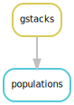

## stacks-asw

Most of this code was written by @marissall to analyse the [asw-para-matched](https://github.com/MarissaLL/asw-para-matched) dataset.
I've taken code from that repo and applied it to the geographical survey dataset with @marissall's help.

### Process reads

### Run stacks

### Popgen analysis

